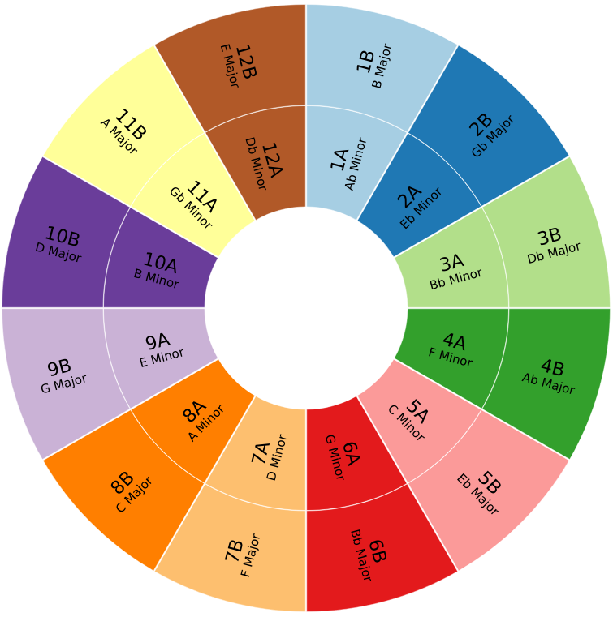

# Camelot Wheel Computation and Graphic Generation

The code contained in this directory computes Camelot wheels from a given CircleOfFifths object ("../../theory/western/CircleOfFifths.py") which in turn is calculated from a provided chromatic scale ("../../theory/western/scales/chromatic.py").

For given chromatic scale:
```
chromatic_scale_pitch_class_names = ['C', 'Db', 'D', 'Eb', 'E', 'F', 'Gb', 'G', 'Ab', 'A', 'Bb', 'B']
```
The graphical output produced is:


