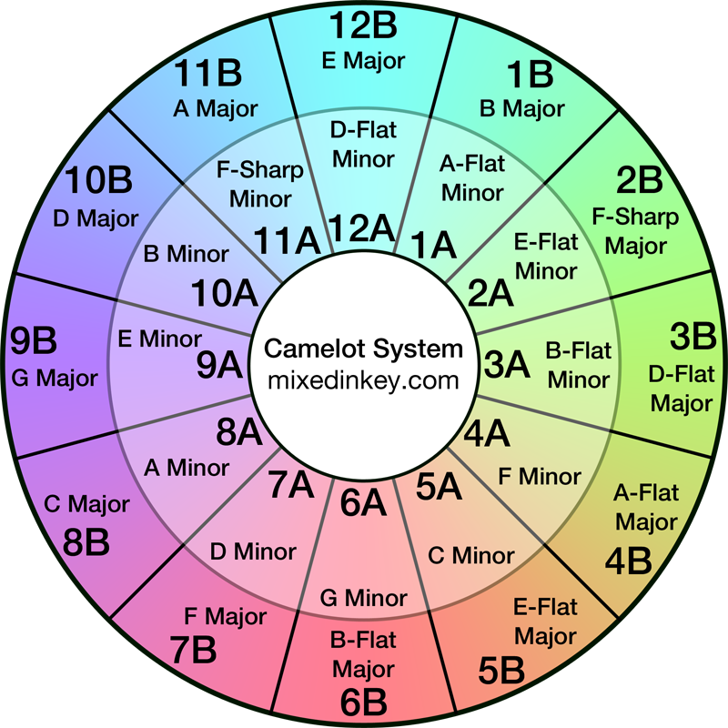

# DJ-Related Modules

I wrote this content to help me automatically curate material for my DJ sets. This is a work in progress...

## Programmatically Generating Mixed In Key's Camelot Wheel

The "Camelot Wheel", shown below, is a tool that helps DJs perform consonant key transitions when mixing a new track into an already playing track. Here is what one looks like (from Mixed In Key's harmonic mixing page):



I wanted to be able to programmatically compute this information from "first principles" (vis-a-vis music theory) to help create future code that facilitates track selection for DJ sets.

Running the code:

```
from music_production_and_performance.DJ.CamelotWheel import CamelotWheel
c = CamelotWheel()
c.summary()
```

Output:

```
[(('A', '8A'), ('C', '8B')),
 (('E', '9A'), ('G', '9B')),
 (('B', '10A'), ('D', '10B')),
 (('F#', '11A'), ('A', '11B')),
 (('Db', '12A'), ('E', '12B')),
 (('Ab', '1A'), ('B', '1B')),
 (('Eb', '2A'), ('F#', '2B')),
 (('Bb', '3A'), ('Db', '3B')),
 (('F', '4A'), ('Ab', '4B')),
 (('C', '5A'), ('Eb', '5B')),
 (('G', '6A'), ('Bb', '6B')),
 (('D', '7A'), ('F', '7B'))]
```

This information is also available as class attributes, which is how I intend to automate its use in the future.